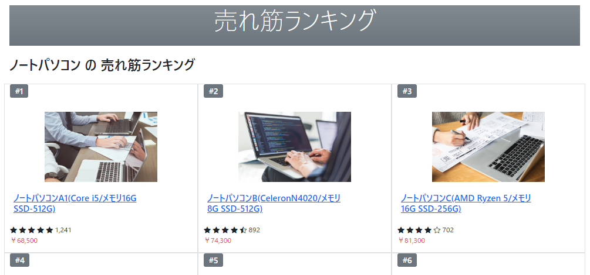
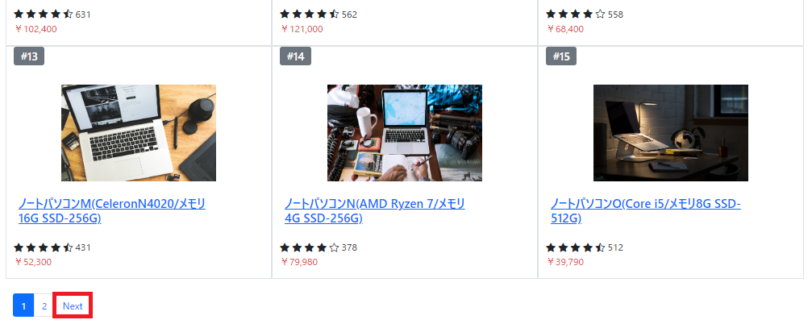
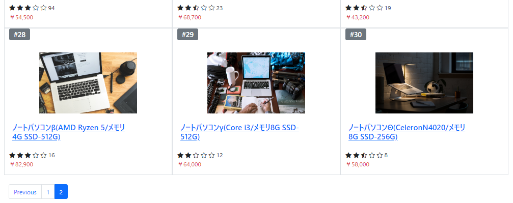
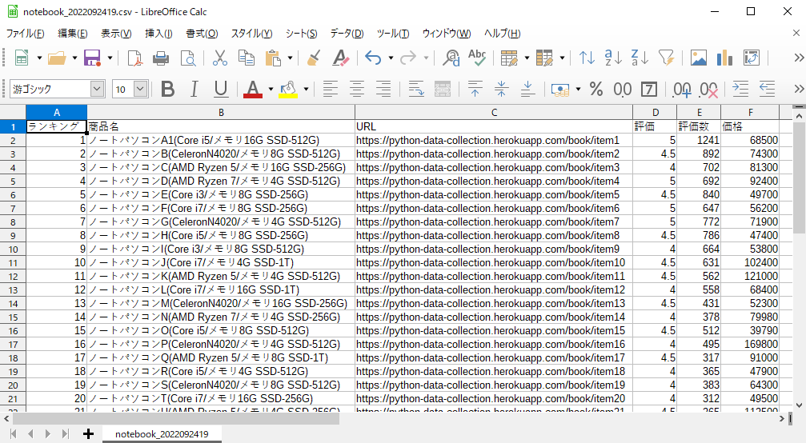

# サイト内の商品情報を最終ページまで取得
ランキングサイト内の一覧ページ上の全商品情報を最終ページまで取得

 

## ランキングサイトの一覧ページから各商品のデータ収集

 

## ボタン(Next)が押下可能なら次ページ遷移で処理を継続

 

## 最終ページでボタン(Next)が存在しないか上限(10ページ)に達するまで処理を続行

 

## 収集データをCSV出力

 
